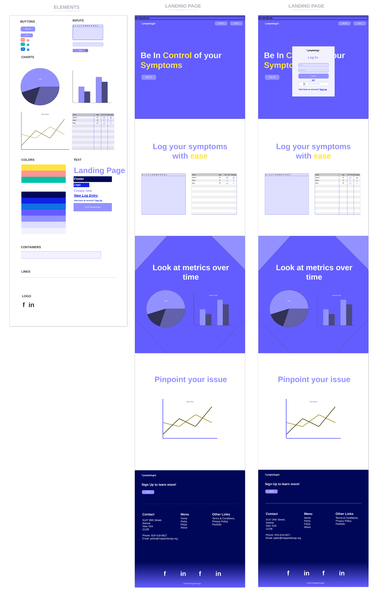

# Introduction

Symptologix is app created for people to log smyptoms on the go on either mobile or desktop. It uses analytics over time to help diagnose health issues.

## Technologies Used

NOTE: `KnexJS` use for migrations (personal preference)

## Getting Started

## Planning

### ERD

The diagram was created by first mapping out the `prisma` schema. This was then passed into the prisma to ERD generator here: [ERD Generator](https://prisma-erd.simonknott.de/).

### Wireframing

Below shows a typical logging step using a wireflow. It shows steps to create a `Category`, `Subcategory` and `Entry`.

## Wireflow

## Wireflow

## Screenshots

## Breakdown of Application

## Front End Architecture

## Challenges

## Unsolved Problems

## Future Stretch Goals

## Resources

1.  [ERD Generator](https://prisma-erd.simonknott.de/)

2.  [Badges](https://ileriayo.github.io/markdown-badges/#markdown-badges)

3.  [Shiled Docs](https://shields.io/)

4.  [ESLint Changelog](https://github.com/conventional-changelog/commitlint)

5.  [Wireflow](https://lucid.app/lucidchart/dae4f2db-44b2-4960-b5fa-0b0a74966ceb/edit?beaconFlowId=6A9D8E8349A1D84A&invitationId=inv_89316d7b-46c1-4c08-b1f0-a8010b02a21c&page=0_0#)

6.  [Wireframes](https://lucid.app/lucidchart/26ce0ac3-a98a-4844-85b5-90c444026f65/edit?beaconFlowId=BB9C9229C1909359&invitationId=inv_b8d2514a-828e-4032-bf11-10f7e414d1f8&page=0_0#)
