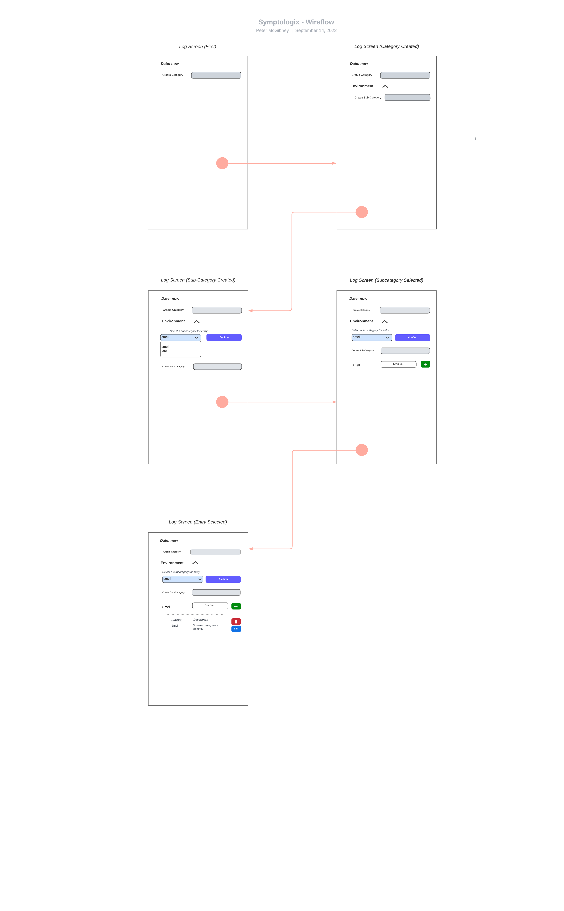

# Introduction
Symptologix is app created for people to log smyptoms on the go on either mobile or desktop. It uses analytics to help diagnose a maysterious health issue.

## Technologies Used
* NextJS 
* TypeScript
* Prisma - For ORM
* Knex - For Migrations (personal preference)
* Docker
* PostgreSQL

## Getting Started

## Planning

### ERD

The diagram was created by first mapping out the `prisma` schema. This was then passed into the prisma to ERD generated here: [ERD Generator](https://prisma-erd.simonknott.de/).

### Wireframing
Below shows a typical logging step using a wireflow. It shows steps to create a `Category`, `Subcategory` and `Entry`.

## Screenshots

## Breakdown of Application

## Front End Architecture

## Challenges

## Unsolved Problems

## Future Stretch Goals

## Resources

[ERD Generator](https://prisma-erd.simonknott.de/)

